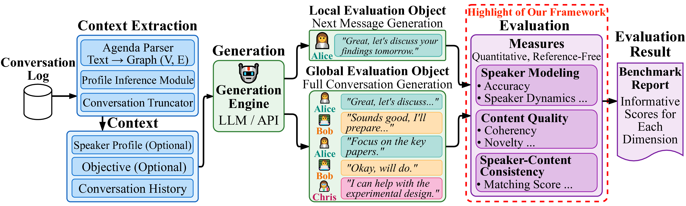

# MPCEval: A Benchmark for Multi-Party Conversation Generation

**MPCEval** is a comprehensive, task-aware evaluation framework for assessing multi-party conversation generation systems. MPCEval provides decomposed, reference-free, quantitative, and reproducible metrics across three key dimensions: **speaker modeling**, **content quality**, and **speaker-content consistency**.

## Why MPCEval?

Evaluating multi-party conversations is fundamentally different from two-party dialogue:
- **Complex turn-taking dynamics** with multiple valid next speakers
- **Role-dependent behavior** across diverse participants
- **Long-range conversational structure** and information flow
- **Multiple equally valid continuations** making reference-based metrics inadequate

MPCEval addresses these challenges through:
- ✅ **Task-aware evaluation**: Distinguishes local (next-message prediction) from global (full-conversation generation)
- ✅ **Decomposed metrics**: Separates speaker selection, content generation, and speaker-content alignment
- ✅ **Reference-free**: No dependence on single "gold standard" human references
- ✅ **Quantitative & reproducible**: Deterministic scoring across datasets and models
- ✅ **Method-agnostic**: Works with any generation approach (prompt-based, fine-tuned, etc.)
- ✅ **Dataset-agnostic**: Supports any text-based multi-party conversation data

## Framework Overview



## Installation

### Requirements
- Python 3.8+
- PyTorch 1.9+
- CUDA (optional, for GPU acceleration)

### Dependencies
Core dependencies is listed in `requirements.txt`:
- `torch` - Deep learning framework
- `sentence-transformers` - Sentence embeddings
- `scikit-learn` - Clustering and vectorization
- `numpy` - Numerical computing

Optional dependencies:
- `bertopic` - Topic modeling (for LS-TA, TES)
- `transformers` - HuggingFace models (for DAF, LL)
- `gensim` - Word embeddings (for lexical metrics)

### Install
```bash
git clone https://github.com/Owen-Yang-18/MPCEval.git
cd MPCEval
pip install -r requirements.txt
```

---

## Quick Start

### Input Data Format

MPCEval uses JSON/JSONL formats:

**For local evaluation (next-message prediction):**
```json
{
  "dialogue_id": "conv_001",
  "context": [
    {"speaker": "Alice", "utterance": "What do you think about the proposal?"},
    {"speaker": "Bob", "utterance": "I think it needs more detail."},
    {"speaker": "Charlie", "utterance": "Agreed, especially the timeline."}
  ],
  "next_speaker": "Alice",
  "next_message": "Let me clarify the timeline then."
}
```

**For global evaluation (full conversation):**
```json
{
  "dialogue_id": "conv_001",
  "conversation": [
    {"speaker": "Alice", "utterance": "What do you think about the proposal?"},
    {"speaker": "Bob", "utterance": "I think it needs more detail."},
    {"speaker": "Charlie", "utterance": "Agreed, especially the timeline."},
    {"speaker": "Alice", "utterance": "Let me clarify the timeline then."}
  ]
}
```

### Basic Usage Example

**Evaluate local speaker modeling:**
```bash
python -m src.local_speaker.main \
  --dialogue-path data/conversations.json \
  --mode batch \
  --window-size 10 \
  --embedding-model sentence-transformers/all-MiniLM-L6-v2
```

**Evaluate global speaker diversity:**
```bash
python -m src.global_speaker.main \
  --input-path data/full_conversations.json \
  --output-path results/global_speaker_scores.json
```

---

## Datasets

### DeliData
**Source:** [DeliData: A dataset for deliberation in multi-party problem solving](https://arxiv.org/pdf/2108.05271)

**Description:** Collaborative problem-solving dialogues based on the Wason card selection task. Contains 500 dialogues with 27-40 utterances and 3-4 speakers per conversation.

**Access:** Available through the ACL Anthology or contact the original authors.

**Use case:** Suitable for both local (next-message prediction) and global (full-conversation generation) evaluation.

### MPDD (Multi-Party Dialogue Dataset)
**Source:** [MPDD: A Multi-Party Dialogue Dataset](https://aclanthology.org/2020.lrec-1.76.pdf)

**Description:** Chinese multi-party dialogues derived from TV scripts, annotated with emotions and interpersonal relations. Contains 1,774 conversations with an average of 10.3 utterances and 2.5 speakers.

**Access:** Available at [https://github.com/ntunlplab/Dialogue-MPDD](https://github.com/ntunlplab/Dialogue-MPDD/tree/main)

**Use case:** Primarily suited for local evaluation (next-message prediction) due to shorter conversation lengths.

---

## Usage Guide

### Local Evaluation

Local evaluation assesses the quality of a **single predicted next turn** given conversation history.

#### 1. Local Speaker Modeling

Evaluates whether the predicted next speaker is plausible given recent conversational cues.

```bash
python -m src.local_speaker.main \
  --dialogue-path data/test_pairs.json \
  --mode batch \
  --window-size 10 \
  --embedding-model sentence-transformers/all-MiniLM-L6-v2 \
  --topic-backend bertopic \
  --output-path results/local_speaker_scores.jsonl
```

**Key parameters:**
- `--window-size`: Number of recent turns to consider (default: 10)
- `--embedding-model`: Sentence transformer model for LS-ES
- `--topic-backend`: Topic modeling backend (`bertopic` or `lda`) for LS-TA
- `--mode`: `single` (evaluate one random sample) or `batch` (evaluate all)

**Output metrics:** DNR, IR, PF, LS-ES-avg, LS-ES-max, LS-TA

#### 2. Local Content Quality

Evaluates whether the predicted message content appropriately continues the discussion.

```bash
# Example: Evaluate lexical novelty
python -m src.local_content_unsupervised.main \
  --pairs-path data/test_pairs.jsonl \
  --metric lexical \
  --mode batch \
  --window-size 10 \
  --output-path results/lexical_scores.jsonl

# Example: Evaluate message-level semantic novelty
python -m src.local_content_unsupervised.main \
  --pairs-path data/test_pairs.jsonl \
  --metric message \
  --mode batch \
  --embedding-model sentence-transformers/all-MiniLM-L6-v2

# Example: Evaluate dialogue act transition fit
python -m src.local_content_unsupervised.main \
  --pairs-path data/test_pairs.jsonl \
  --metric dialogue-act \
  --mode batch \
  --da-backend rule-based

# Example: Evaluate log-likelihood
python -m src.local_content_unsupervised.main \
  --pairs-path data/test_pairs.jsonl \
  --metric flowing-ll \
  --mode batch \
  --ll-model gpt2 \
  --ll-device cuda

# Example: Evaluate topic expansion
python -m src.local_content_unsupervised.main \
  --pairs-path data/test_pairs.jsonl \
  --metric topic-expansion \
  --mode batch \
  --topic-backend bertopic
```

**Available metrics:**
- `lexical`: Weighted embedding-aware lexical novelty (LNR-E-w)
- `message`: Message-level semantic novelty (M-SNS-min, M-SNS-avg)
- `dialogue-act`: Dialogue act transition fit (DAF)
- `flowing-ll`: Log-likelihood from causal LM (LL)
- `topic-expansion`: Topic expansion score (TES)

**Key parameters:**
- `--metric`: Which local content quality metric to compute
- `--window-size`: Context window size
- `--da-backend`: Dialogue act classifier
- `--ll-model`: Language model for log-likelihood (e.g., `Qwen/Qwen-3-8B-base`)

**Output metrics:** LNR-E-w, M-SNS-min, M-SNS-avg, DAF, LL, TES (depending on metric)

#### 3. Local Speaker-Content Consistency

Evaluates whether the predicted message content is consistent with the predicted speaker's communication patterns.

```bash
python -m src.local_speaker_content_consistency.main \
  --pairs-path data/test_pairs.jsonl \
  --mode batch \
  --window-size 10 \
  --embedding-backend sentence-transformers \
  --embedding-model sentence-transformers/all-MiniLM-L6-v2 \
  --output-path results/local_consistency_scores.jsonl
```

**Key parameters:**
- `--window-size`: Context window size
- `--embedding-backend`: `sentence-transformers` or `tfidf`
- `--embedding-model`: Model for semantic embeddings

**Output metrics:** LSCC-ES-avg, LSCC-ES-max, LSCC-ES-min

---

### Global Evaluation

Global evaluation assesses the quality of an **entire generated conversation**, focusing on long-range properties.

#### 1. Global Speaker Modeling

Evaluates participation structure and information distribution across speakers.

```bash
python -m src.global_speaker.main \
  --input-path data/full_conversations.json \
  --output-path results/global_speaker_scores.json \
  --global-spread-method mst \
  --lambda-weight 0.5 \
  --radius-percentile 0.9
```

**Key parameters:**
- `--global-spread-method`: Method for computing semantic spread (`mst` for minimum spanning tree)
- `--lambda-weight`: Weight for balancing spread components
- `--radius-percentile`: Percentile for local novelty radius

**Output metrics:** NSE (Normalized Speaker Entropy), SC-Gini (Semantic Concentration Gini)

#### 2. Global Content Quality

Evaluates semantic progression and coherence over the full conversation.

```bash
python -m src.global_content_unsupervised.main \
  --input-path data/full_conversations.json \
  --output-path results/global_content_scores.json \
  --embedding-model sentence-transformers/all-MiniLM-L6-v2 \
  --epsilon 1e-6
```

**Key parameters:**
- `--embedding-model`: Model for computing semantic trajectories
- `--epsilon`: Stabilization constant for harmonic mean (default: 1e-6)

**Output metrics:** PD (Progression Distance), HMP (Harmonic Mean Progression)

#### 3. Global Speaker-Content Consistency

Evaluates whether each speaker maintains consistent semantic patterns throughout the conversation.

```bash
python -m src.global_consistency.main \
  --input-path data/full_conversations.json \
  --output-path results/global_consistency_scores.json \
  --max-k 5 \
  --min-cluster-size 3 \
  --embedding-model sentence-transformers/all-MiniLM-L6-v2 \
  --device cuda
```

**Key parameters:**
- `--max-k`: Maximum number of centroids per speaker (auto-selected via BIC)
- `--min-cluster-size`: Minimum utterances per speaker to compute clustering
- `--embedding-model`: Model for semantic representations

**Output metrics:** GSCC-DC-avg, GSCC-DC-max (for single and multi-centroid variants)

---

## Understanding Output

### Local Evaluation Output

Each JSONL line contains per-sample scores:
```json
{
  "dialogue_id": "conv_001",
  "dnr": 0.0,
  "ir": 0.245,
  "pf": 0.333,
  "ls_es_avg": 0.672,
  "ls_es_max": 0.823,
  "ls_ta": 0.756
}
```

Summary statistics are written to a separate JSON file:
```json
{
  "mean": {"dnr": 0.234, "ir": 0.312, ...},
  "std": {"dnr": 0.142, "ir": 0.089, ...},
  "count": 150
}
```

### Global Evaluation Output

Per-conversation scores with aggregated metrics:
```json
{
  "dialogue_id": "conv_001",
  "nse": 0.892,
  "sc_gini": 0.345,
  "progression_distance": 1.234,
  "harmonic_mean_progression": 0.876,
  "gscc_dc_avg": 0.821,
  "gscc_dc_max": 0.913
}
```